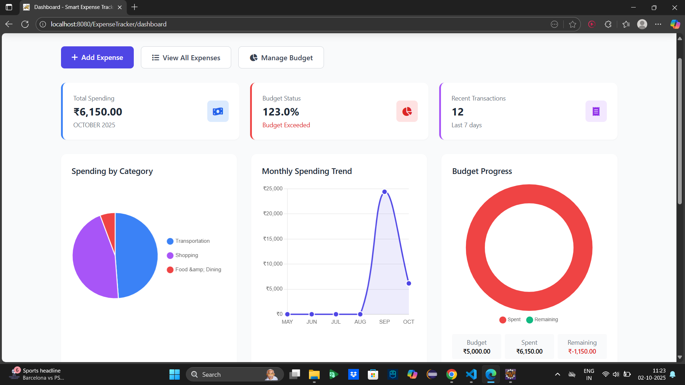

# 💰 Smart Expense Tracker


A comprehensive full-stack web application for personal finance management built with Java Servlets, JSP, and modern web technologies. Track expenses, set budgets, and visualize spending patterns with an intuitive, responsive interface.

---

## 🎥 Project Demo

<video controls src="SET_Demo.mp4" title="Demo_Recording"></video>

---

## ✨ Key Features

### 🔐 User Authentication
- Secure user registration and login system
- Password hashing with SHA-256 and salt
- Session management with timeout protection
- Protected routes with authentication filters

### 💸 Expense Management
- **Add Expenses**: Categorize expenses with custom descriptions
- **View & Filter**: Search expenses by date range, category, or keywords
- **Delete Expenses**: Remove unwanted transactions securely
- **Multiple Payment Methods**: Track cash, card, and UPI payments

### 📊 Budget Tracking
- Set monthly spending limits
- Visual progress indicators with color-coded alerts
- Real-time budget status (Safe → Warning → Exceeded)
- Percentage-based threshold alerts (80% warning, 100% exceeded)

### 📈 Data Visualization
- Interactive pie charts for category-wise spending
- Responsive Chart.js integration
- Monthly spending summaries
- Visual budget progress indicators

### 🎨 Modern UI/UX
- **Responsive Design**: Works perfectly on desktop, tablet, and mobile
- **Tailwind CSS**: Professional, modern styling
- **Font Awesome Icons**: Intuitive visual elements
- **Real-time Validation**: Instant form feedback

---

## 🛠 Technology Stack

| Layer | Technology |
|-------|------------|
| **Frontend** | HTML5, CSS3, JavaScript, Tailwind CSS, Chart.js |
| **Backend** | Java Servlets, JSP, JDBC |
| **Database** | MySQL 8.0+ |
| **Security** | SHA-256 Password Hashing, Prepared Statements, Session Management |
| **Build Tool** | Maven |
| **Server** | Apache Tomcat 9+ |
| **Icons** | Font Awesome 6 |

---

## 🚀 Quick Start

### Prerequisites
- Java JDK 8 or higher
- Apache Tomcat 9+
- MySQL 8.0+
- Maven 3.6+

### Installation & Setup

1. **Clone the Repository**
   ```bash
   git clone https://github.com/your-username/smart-expense-tracker.git
   cd smart-expense-tracker
   ```

2. **Database Setup**
   ```sql
   -- Create and use database
   CREATE DATABASE expense_tracker;
   USE expense_tracker;
   
   -- Run the setup script
   SOURCE database_setup.sql;
   ```

3. **Configure Database Connection**
   ```java
   // Update src/main/java/com/expense/util/DBConnection.java
   private static final String URL = "jdbc:mysql://localhost:3306/expense_tracker";
   private static final String USERNAME = "your_mysql_username";
   private static final String PASSWORD = "your_mysql_password";
   ```

4. **Build and Deploy**
   ```bash
   # Build with Maven
   mvn clean compile
   mvn package
   
   # Deploy WAR file to Tomcat
   # Copy target/ExpenseTracker.war to Tomcat webapps directory
   ```

5. **Access Application**
   ```
   http://localhost:8080/ExpenseTracker
   ```

---

## 📁 Project Architecture

```
smart-expense-tracker/
├── src/main/java/com/expense/
│   ├── dao/              # Data Access Layer
│   │   ├── UserDAO.java
│   │   ├── ExpenseDAO.java
│   │   ├── CategoryDAO.java
│   │   └── BudgetDAO.java
│   ├── model/            # Business Objects
│   │   ├── User.java
│   │   ├── Expense.java
│   │   ├── Category.java
│   │   └── Budget.java
│   ├── servlets/         # Controller Layer
│   │   ├── LoginServlet.java
│   │   ├── RegisterServlet.java
│   │   ├── DashboardServlet.java
│   │   ├── AddExpenseServlet.java
│   │   ├── ViewExpensesServlet.java
│   │   ├── DeleteExpenseServlet.java
│   │   └── BudgetServlet.java
│   └── util/             # Utilities
│       ├── DBConnection.java
│       └── PasswordUtil.java
├── src/main/webapp/
│   ├── views/            # JSP Views
│   │   ├── login.jsp
│   │   ├── register.jsp
│   │   ├── dashboard.jsp
│   │   ├── add-expense.jsp
│   │   ├── view-expenses.jsp
│   │   └── budget.jsp
│   ├── js/               # Client-side Logic
│   │   ├── charts.js
│   │   └── validation.js
│   ├── WEB-INF/
│   │   └── web.xml       # Configuration
│   └── index.jsp         # Entry Point
├── database_setup.sql    # Database Schema
└── pom.xml              # Maven Configuration
```

---

## 🔒 Security Features

- **Password Security**: SHA-256 hashing with unique salt for each user
- **SQL Injection Prevention**: 100% PreparedStatement usage
- **Session Management**: Automatic timeout and validation
- **Input Validation**: Client-side and server-side validation
- **XSS Prevention**: Output encoding in JSP pages
- **Authentication Filters**: Protected route access control

---

## 🎯 Core Functionality

### User Journey
1. **Registration** → Create account with secure credentials
2. **Login** → Access personalized dashboard
3. **Dashboard** → View spending overview and charts
4. **Add Expenses** → Record daily transactions
5. **Set Budget** → Define monthly spending limits
6. **View Reports** → Analyze spending patterns

### Database Schema
- **Users**: Secure user accounts with profile information
- **Categories**: Pre-defined expense categories with icons and colors
- **Expenses**: Transaction records with amount, date, and category
- **Budgets**: Monthly spending limits with progress tracking

---

## 📊 Features in Detail

### Dashboard
- Monthly spending summary
- Category-wise pie chart
- Recent transactions list
- Budget status with visual indicators
- Quick action buttons

### Expense Management
- **Add**: Amount, category, description, date, payment method
- **View**: Sortable table with filtering options
- **Search**: Description-based search functionality
- **Filter**: Date range (Week, Month, Custom), category filters
- **Delete**: Secure expense deletion with confirmation

### Budget System
- Set monthly budget amounts
- Real-time spending percentage calculation
- Color-coded status indicators:
  - 🟢 Safe (<80%)
  - 🟡 Warning (80-99%)
  - 🔴 Exceeded (100%+)
- Visual progress bars

---

## 🎨 UI/UX Highlights

### Responsive Design
- **Mobile-First**: Optimized for all screen sizes
- **Tailwind CSS**: Utility-first styling framework
- **Interactive Elements**: Hover effects, smooth transitions
- **Professional Color Scheme**: Consistent branding throughout

### User Experience
- **Intuitive Navigation**: Clear menu structure
- **Real-time Feedback**: Instant form validation
- **Loading States**: Visual feedback for operations
- **Error Handling**: User-friendly error messages

---

## 🔧 Development Features

### Code Quality
- **MVC Architecture**: Clean separation of concerns
- **DAO Pattern**: Efficient database abstraction
- **Error Handling**: Comprehensive exception management
- **Code Comments**: Detailed documentation throughout

### Performance
- **Database Indexing**: Optimized query performance
- **Efficient Queries**: Proper JOINs and filtering
- **Resource Management**: Proper connection handling
- **Client-side Caching**: Static resource optimization

---

## 🚀 Deployment

### Local Development
```bash
# Using Maven and Tomcat
mvn tomcat7:run

# Access at: http://localhost:8080/ExpenseTracker
```

### Production Considerations
- Configure Tomcat connection pooling
- Set up MySQL production database
- Enable HTTPS with SSL certificate
- Configure proper logging and monitoring

---

## 📈 Future Enhancements

### Planned Features
- [ ] **Export Data**: CSV/PDF expense reports
- [ ] **Recurring Expenses**: Automated monthly expenses
- [ ] **Income Tracking**: Dual tracking of income and expenses
- [ ] **Advanced Charts**: Monthly trends and comparisons
- [ ] **Email Notifications**: Budget alerts via email
- [ ] **Multi-currency Support**: International expense tracking
- [ ] **Data Backup**: Automated database backups
- [ ] **REST API**: Mobile app integration

### Technical Improvements
- [ ] Spring Framework migration
- [ ] Hibernate ORM implementation
- [ ] React frontend integration
- [ ] Docker containerization
- [ ] CI/CD pipeline setup

---

## 🐛 Troubleshooting

### Common Issues
1. **Database Connection Failed**
   - Verify MySQL service is running
   - Check credentials in DBConnection.java
   - Ensure database exists

2. **404 Errors**
   - Check Tomcat deployment
   - Verify context path configuration

3. **JSP Compilation Errors**
   - Ensure JSTL dependencies are available
   - Check Java version compatibility

### Logs Location
- Tomcat logs: `tomcat/logs/`
- Application logs: Check console output

---

## 👨‍💻 Developer

**Your Name**  
*Final Year Computer Science Student*

- 📧 Email: your.email@domain.com
- 💼 LinkedIn: [Mahesh M](https://linkedin.com/in/mmahesh7)
- 🐙 GitHub: [@mmahesh7](https://github.com/mmahesh7)

---

## 🤝 Contributing

Suggestions and improvements are welcome!

1. Fork the project
2. Create your feature branch (`git checkout -b feature/AmazingFeature`)
3. Commit your changes (`git commit -m 'Add some AmazingFeature'`)
4. Push to the branch (`git push origin feature/AmazingFeature`)
5. Open a Pull Request

---

## 🎓 Academic Context

This project demonstrates comprehensive understanding of:
- **Full-Stack Web Development** with Java EE
- **Database Design** and management with MySQL
- **Security Best Practices** in web applications
- **Software Architecture** patterns (MVC, DAO)
- **Modern UI/UX** principles with responsive design
- **Version Control** with Git and GitHub

---

## ⭐ Show Your Support

If this project helped you in your learning journey, give it a ⭐ on GitHub!

---

**Built with ❤️ using Java, Servlets, JSP, and MySQL**

---

## 📞 Support

For questions or issues:
- 📧 Email: mmahesh23022@gmail.com
- 🐛 Create an Issue on GitHub

---

*Last Updated: September 2025*

---
